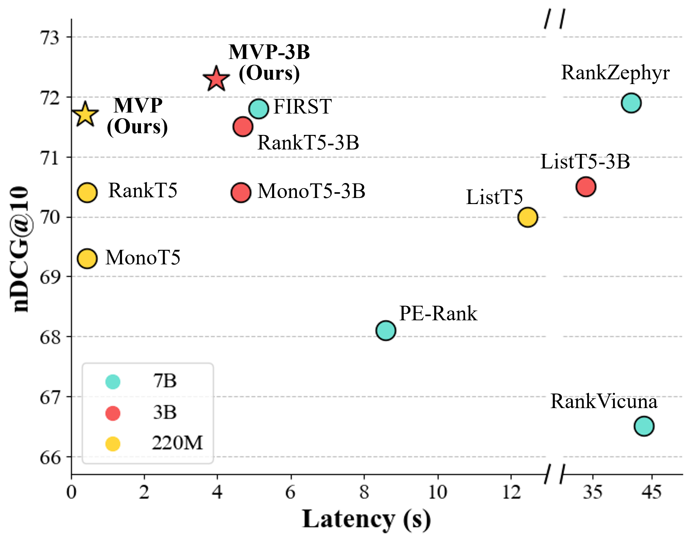

# MVP


This repository contains the official implementation for our EMNLP 2025 paper:

> **Multi-view-guided Passage Reranking with Large Language Models**  
> Jeongwoo Na*, Jun Kwon*, Eunseong Choi, Jongwuk Lee (* : equal contribution)  
> *Accepted to EMNLP 2025 Main Conference*

## Overview
<p align="center">
  
</p>

Recent advances in large language models (LLMs) have shown impressive performance in passage reranking tasks. Despite their success, LLM-based methods still face challenges in efficiency and sensitivity to external biases.
- (i) Existing models rely mostly on autoregressive generation and sliding window strategies to rank passages, which incurs heavy computational overhead as the number of passages increases.
- (ii) External biases, such as positional or semantic bias, hinder the model’s ability to accurately represent passages and the input-order sensitivity.

To address these limitations, we propose Multi-View-guided Passage Reranking (MVP), a non-generative LLM-based reranker that encodes query–passage information into multiple views and computes relevance scores via anchor vectors in a single decoding step. An orthogonal loss encourages diversity across views. With only 220M parameters, MVP matches 7B-scale fine-tuned models while reducing inference latency by 100×, and the 3B variant achieves state-of-the-art results on both in-domain and out-of-domain benchmarks.


## Setup Environment
```
conda env create -f mvp.yaml
conda activate mvp
```

## How to Use
### Run MVP
```
cd inference
bash run_evaluation.sh
```

### Train MVP
```
cd train
bash train.sh
```

## Model Checkpoints
1. [MVP-base](https://huggingface.co/Jun421/MVP-base) : ```Jun421/MVP-base```
2. [MVP-3b](https://huggingface.co/Jun421/MVP-3b): ```Jun421/MVP-3b```
##  Dataset
### Evaluation Datasets
- [BM25-Top100](https://huggingface.co/datasets/Soyoung97/beir-eval-bm25-top100)```Soyoung97/beir-eval-bm25-top100```
> **Note**: Our research was conducted using [ListT5](https://github.com/soyoung97/ListT5). The evaluation dataset is also available through that repository.

### Training Datasets
- [Train/Valid](https://huggingface.co/datasets/Jun421/MVP-train)```Jun421/MVP-train```

This dataset is derived from BEIR/MSMARCO license, and its usage is restricted to **academic purposes** only.
> **Note**: Our training dataset is derived from the [Rank-DistiLLM](https://github.com/webis-de/rank-distillm)
 dataset after further processing. The detailed post-processing procedure can be found in our paper.

## Acknowledgments
We implemented our model based on the following repository: [ListT5](https://github.com/soyoung97/ListT5)

## Citation
TBU
