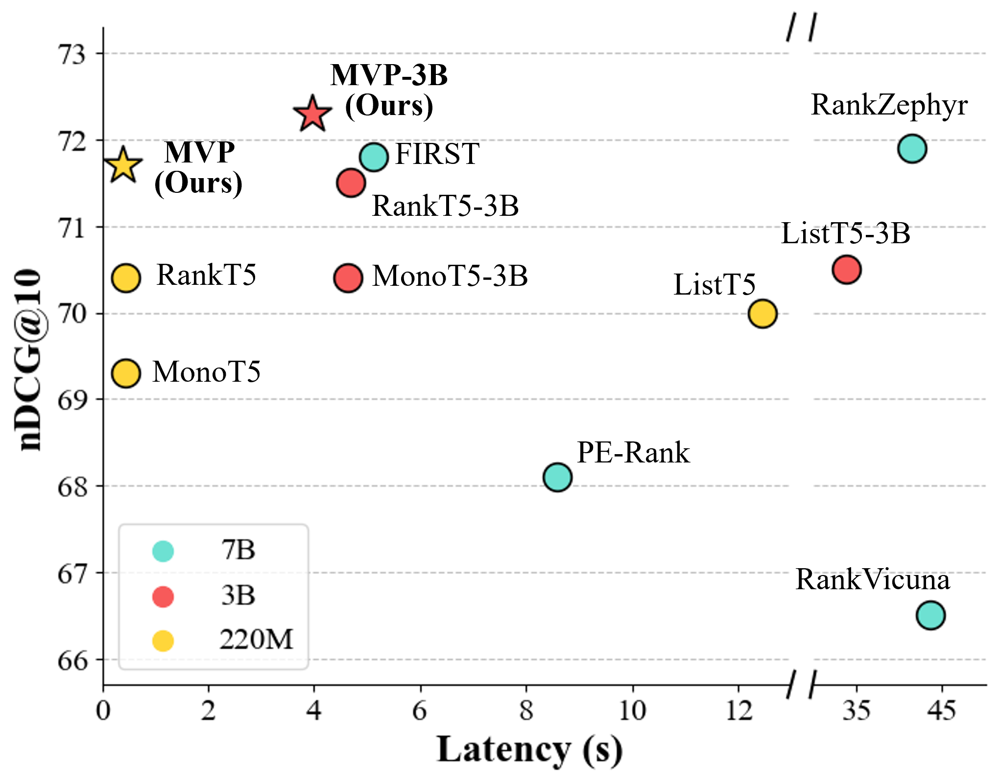

# Revisiting Multi-View-guided Passage Reranking: Reproducibility, Noise Robustness, and View Token Distinctiveness


The original paper that we aim to reproduce is:

> **Multi-view-guided Passage Reranking with Large Language Models**  
> Jeongwoo Na*, Jun Kwon*, Eunseong Choi, Jongwuk Lee (* : equal contribution)  
> *Accepted to EMNLP 2025 Main Conference*


In this repository, we layout our reproducibility process and provide clarity on how to run our extension experiments. 


## Overview of MVP
<p align="center">
  
</p>

Recent advances in large language models (LLMs) have shown impressive performance in passage reranking tasks. Despite their success, LLM-based methods still face challenges in efficiency and sensitivity to external biases.
- (i) Existing models rely mostly on autoregressive generation and sliding window strategies to rank passages, which incurs heavy computational overhead as the number of passages increases.
- (ii) External biases, such as positional or semantic bias, hinder the model’s ability to accurately represent passages and the input-order sensitivity.

To address these limitations, Na et al. (2025) proposed Multi-View-guided Passage Reranking (MVP), a non-generative LLM-based reranker that encodes query–passage information into multiple views and computes relevance scores via anchor vectors in a single decoding step. An orthogonal loss encourages diversity across views. With only 220M parameters, MVP matches 7B-scale fine-tuned models while reducing inference latency by 100×, and the 3B variant achieves state-of-the-art results on both in-domain and out-of-domain benchmarks.


## Setup Environment
```
conda env create -f mvp.yaml
conda activate mvp
```

## How to Use
### Shuffle or reverse the order of candidate passages in a jsonl file (e.g for reproducing the robustness table)
```
python rev_shuffle_data.py --input inference/eval_data/jsonl_input_file --output_rev inference/eval_data/jsonl_output_file_name --output_shuffle inference/eval_data/jsonl_output_file_name
```
Here, `--output_rev` reverses the order of the candidate passages for each query in the jsonl file and  `--output_shuffle` shuffles the order of the candidate passages. 


### Run MVP
```
cd inference
bash run_evaluation_copy.sh
```

To evaluate MVP on a subset of datasets (e.g. only DL19 and DL20) or on other datasets (e.g. the shuffled or reversed datasets)datasets, uncomment the `TEST_DATA` lines accordingly. To measure the FLOPs values for the datasets, add the flag `--measure_flops` in the bash file. Finally, to evaluate a differnt model, change `--model_path` to the desired model path. However, do note that you should also change `--n_special_tokens` accordingly when using a different view model (e.g. the models that are trained with a different number of view tokens, varying from 1 to 6 view tokens).

### Reproduced plots
To reproduce figures 4 and 6 from the original paper (FLOPs and view token ablation study), we provide the following notebook: `figure6_and_4_reproduced_plot.ipynb` under the `inference` directory.

### Train MVP
```
cd train
bash train_copy.sh
```
To train the 3B MVP model, uncomment the corresponding code in `train_copy.sh`. To train the MVP model with a different number of view tokens (e.g. for reproducing the ablation study of the original paper), you can vary `n_special_tokens()` from 1 to 6. 

## Model Checkpoints
1. [MVP-base](https://huggingface.co/Jun421/MVP-base) : ```Jun421/MVP-base```
2. [MVP-3b](https://huggingface.co/Jun421/MVP-3b): ```Jun421/MVP-3b```
##  Dataset
### Evaluation Datasets
- [BM25-Top100](https://huggingface.co/datasets/Soyoung97/beir-eval-bm25-top100)```Soyoung97/beir-eval-bm25-top100```
> **Note**: The research was conducted using [ListT5](https://github.com/soyoung97/ListT5). The evaluation dataset is also available through that repository.

### Training Datasets
- [Train/Valid](https://huggingface.co/datasets/Jun421/MVP-train)```Jun421/MVP-train```

This dataset is derived from BEIR/MSMARCO license, and its usage is restricted to **academic purposes** only.
> **Note**: The training dataset is derived from the [Rank-DistiLLM](https://github.com/webis-de/rank-distillm)
 dataset after further processing. The detailed post-processing procedure can be found in the original paper.


## Extension 
### Noise experiments
The results for the noise experiments can be done using the `anchor_robust_test.py`.
The qualitative experiments done using:
```bash
cd inference
python ./anchor_robust_test.py \
  --input_path ./eval_data/dl19.json \
  --topk 100 \
  --n_special_tokens 4 \
  --model_path Jun421/MVP-base \
  --noise random \
  --retrieve_k 10 \
  --instance_idx 0
```

or for reranking the top-k without adding noise:
```bash
cd inference
python ./anchor_robust_test.py \
  --input_path ./eval_data/dl19.json \
  --topk 100 \
  --n_special_tokens 4 \
  --model_path Jun421/MVP-base \
  --noise none \
  --retrieve_k 10 \
  --instance_idx 0
```


The quantative experiments are run using:
```bash
cd inference
python ./anchor_robust_test.py \
  --input_path ./eval_data/dl19.json \
  --topk 100 \
  --n_special_tokens 4 \
  --model_path Jun421/MVP-base \
  --noise none \
  --retrieve_k 10
```
where the arguments `--noise` can be set to one option from `[none, junk, random, worst1000]`and `--retrieve_k` can be set to any integer such as 10 or 100. To reproduce all results from the paper you can run the following script:
```bash
cd inference
./run_robustness_tests.sh
```
which will run and save the results to a file which can be viewed in the `analysis_robustness_tests.ipynb` notebook.


### View Experiments
To produce the results for the different aggregation strategies you can first train the models. With mean aggregations is the default setup and thus same as in [Train MVP](#train-mvp). Max aggregation can be done by running
```bash
cd train
./train_max.sh
```

Evaluation can be done using:
```bash
cd inference
# Inference on all dataset when trained and inference with mean aggrregation
./run_evaluation_mean.sh

# Inference on all dataset when trained with mean aggrregation and inference on individual views
./run_evaluation_mean_agg_seperate_views.sh

# Inference on all dataset when trained and inference with max aggrregation
./run_evaluation_max_agg.sh

# Inference on all dataset when trained with max aggrregation and inference on individual views
./run_evaluation_max_agg_seperate_views.sh
```
Metrics are printed out for each dataset but can also be computed and saved from the stored inference results (results are stored at the `--output_path` in `evaluation.py`. Computing and saving metrics can be done the following:
```bash
cd inference
./compute_and_save_metrics.sh <input directory> <output directory> <file prefix>
```
where
- `input directory`: The directory containing the inference results like `mvp-dl19.jsonl`
- `output directory`: The directory where the file with metrics are written to
- `file prefix`: Optional parameter. The script search for the result files in the `input directory` based on dataset name e.g. `dl19`. If files have a prefix such as `mvp-dl19.jsonl`, you want to add `"mvp-"` as file prefix


## Acknowledgments
The original authors implemented their model based on the following repository: [ListT5](https://github.com/soyoung97/ListT5)

## Citation
For the citation of the original paper, you can cite the following:
```
@misc{na2025multiviewguidedpassagererankinglarge,
      title={Multi-view-guided Passage Reranking with Large Language Models}, 
      author={Jeongwoo Na and Jun Kwon and Eunseong Choi and Jongwuk Lee},
      year={2025},
      eprint={2509.07485},
      archivePrefix={arXiv},
      primaryClass={cs.IR},
      url={https://arxiv.org/abs/2509.07485}, 
}
```
